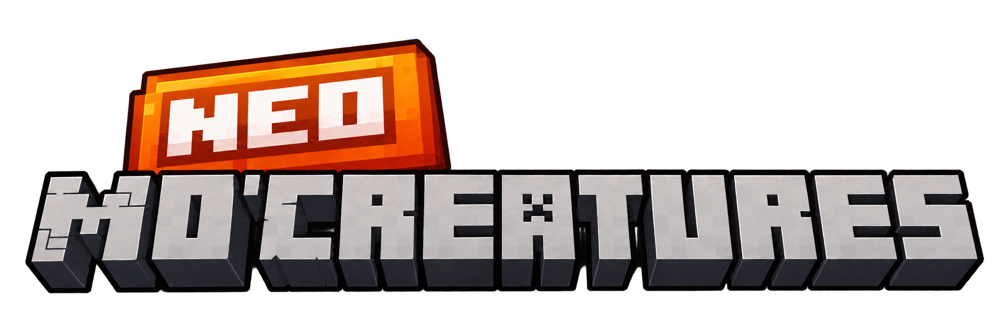

<p align="center">
  
</p>

<h1 align="center">Neo Mo' Creatures</h1>

<p align="center">
  A faithful port of the classic <b>Mo' Creatures</b> to <b>Minecraft 1.21.1</b> on <b>NeoForge</b>.
</p>

---

## About

Neo Mo' Creatures brings back the whole Mo' Creatures bestiary to modern Minecraft. It is not a
mechanical update of the old code: every creature was rebuilt on top of 1.21.1 / NeoForge systems
(attributes, synced entity data, data-driven spawns, tags, loot tables), while keeping the behaviour,
stats, models, textures and sounds of the original as close as possible.

Along the way, many bugs from the original were fixed and a few quality-of-life improvements were
added — always trying to stay true to how the mod felt.

## Features

- **Horses** — dozens of breeds with breeding and genetics, from wild horses and zebras to pegasi,
  unicorns, fairy, bone and ghost horses.
- **Tameable companions** — big cats, bears, elephants and mammoths, ostriches, komodo dragons,
  kitties, bunnies, birds, snakes, turtles, foxes, raccoons, goats, and more. Tame them, ride them,
  breed them and carry them around in **pet amulets**.
- **Wyverns and the Wyvern Lair** — tame and ride wyverns, and travel to their own dimension with
  its unique trees, blocks and creatures.
- **Aquatic life** — sharks, dolphins, manta rays, stingrays, jellyfish and many kinds of fish, with
  eggs and a fish net.
- **Critters and insects** — ants, bees, butterflies, crickets, dragonflies, fireflies, flies,
  grasshoppers, snails, crabs, moles, mice, the tree-planting ent...
- **Hostile mobs** — green, cave and fire ogres, werewolves, wraiths and flame wraiths, horse mobs,
  manticores, scorpions, silver skeletons, wild wolves, rats, crocodiles, and the block-throwing
  **Mini Golem** and **Big Golem**.
- **Items and gear** — ancient silver equipment, scorpion armour with set bonuses, scorpion
  weapons, kitty beds, litter boxes, whips, scrolls and much more.

### Improvements over the original

- Golems never tear out containers or unbreakable blocks, respect `mobGriefing` and protected
  areas, and always give the blocks they took back to the world.
- Creatures carrying held items never lose them when they despawn or die.
- Babies and differently-sized variants appear at their real size immediately.
- Smoother, ghast-like flight for wild wyverns.
- Spawns and drop lists are data-driven (biome modifiers, tags and loot tables), so they can be
  tweaked with a datapack.

## Requirements

| | Version |
|---|---|
| Minecraft | 1.21.1 |
| NeoForge | 21.1.244 or newer |
| Java | 21 |

## Installation

1. Install [NeoForge](https://neoforged.net/) for Minecraft 1.21.1.
2. Download the latest `neomocreatures-x.x.x.jar` from the Releases page.
3. Drop it into your `mods` folder and launch the game.

The mod is required on both the client and the server.

## Building from source

```bash
git clone <this repository>
cd NeoMoCreatures-mod
./gradlew build
```

The built jar ends up in `NeoMoCreatures-mod/build/libs/`. To test in a development client, run
`./gradlew runClient` (use `gradlew.bat` on Windows).

## Credits

Neo Mo' Creatures is a port developed by **Juan Andrés Castellanos Huerta**, built on the work of
many people:

- **[DrZhark's Mo' Creatures](https://github.com/DrZhark/mocreaturesdev)** — the original mod.
  Author, coding, AI, animations, models and textures by **DrZhark**; models and textures by
  **BlockDaddy**; coding by **Bloodshot**.
- **[Mo' Creatures 1.16.5 by multision](https://github.com/multision/mocreaturesdev)** — the main
  reference for this port. Maintained by **multision** and **TheidenHD**, building on the
  Mo' Creatures Extended team (**ACGaming**, **IcarussOne**, **xJon**).
- **[Mo' Creatures Extended](https://github.com/Elite-Modding-Team/MoCreaturesExtended)** — the
  1.12.2 continuation by **ACGaming**, **IcarussOne**, **Tomanex**, **DemonLexe** and **xJon**.
  Reference for the content added after the original: the wyvwood and wyvern stone decorative
  blocks (doors, trapdoors, fences, slabs, stairs, walls, buttons, pressure plates and the
  gleaming glass pane), with their textures and recipes, adapted for NeoForge 1.21.1.
- **[VExt Mod](https://github.com/Lord-of-the-Rings-Middle-Earth-Mod/VExt-Mod)** — reference for
  the Wyvern Lair trees.

All original creatures, models, textures and sounds belong to their respective authors.

## License

This project is licensed under the **GNU General Public License v3.0**, like the Mo' Creatures
source it is based on. See [LICENSE](LICENSE) for the full text.
